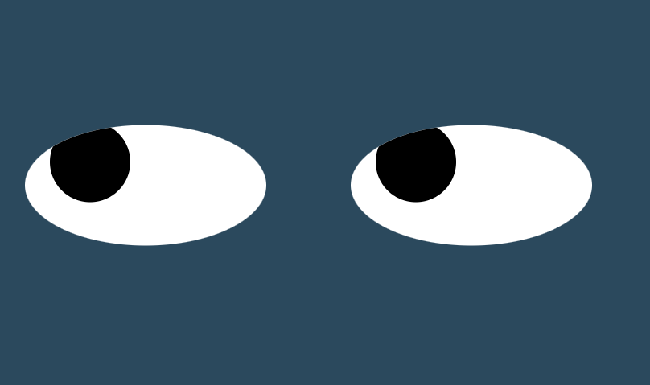

# The-Eyes-Have-It
Eyes moving with cursor

Fun with HTML, CSS and JavaScript - the software has two synchronized eyes that will follow the mouse pointer. Eye and ball shape can be adjusted in the css file, as can color. 

At this time the code serves its function as an educational tool - allowing users to experience working with with HTML and CSS. Future improvements could include a button to change eye color, or a random function to have the eyes go crazy every now and then.

To run this software - download the files and save them into a folder. Using Visual Studio Code, or your preferred local web server, run index.html to see the program in action. Move your mouse and see the eyes move.

MIT License

Copyright (c) 2022 matthewbrach

Permission is hereby granted, free of charge, to any person obtaining a copy of this software and associated documentation files (the "Software"), to deal in the Software without restriction, including without limitation the rights to use, copy, modify, merge, publish, distribute, sublicense, and/or sell copies of the Software, and to permit persons to whom the Software is furnished to do so, subject to the following conditions:

The above copyright notice and this permission notice shall be included in all copies or substantial portions of the Software.

THE SOFTWARE IS PROVIDED "AS IS", WITHOUT WARRANTY OF ANY KIND, EXPRESS OR IMPLIED, INCLUDING BUT NOT LIMITED TO THE WARRANTIES OF MERCHANTABILITY, FITNESS FOR A PARTICULAR PURPOSE AND NONINFRINGEMENT. IN NO EVENT SHALL THE AUTHORS OR COPYRIGHT HOLDERS BE LIABLE FOR ANY CLAIM, DAMAGES OR OTHER LIABILITY, WHETHER IN AN ACTION OF CONTRACT, TORT OR OTHERWISE, ARISING FROM, OUT OF OR IN CONNECTION WITH THE SOFTWARE OR THE USE OR OTHER DEALINGS IN THE SOFTWARE.
